# Colab MCP 🔗

> **Stop losing context when you switch between AI coding tools.**

A Model Context Protocol (MCP) server that lets Claude Desktop, Cursor, Codex, and other AI coding assistants share logs and session history with each other.

[](https://badge.fury.io/py/colab-mcp)
[](https://opensource.org/licenses/MIT)

## The Problem

You're coding with Claude Desktop. You make progress. Then you switch to Cursor to test something. Now you've lost all your context. You explain everything again. Then you jump to Codex. Explain it all over again. 

**It's exhausting.**

## The Solution

Colab MCP is a shared MCP server that exposes your chat logs, terminal history, and IDE events as **tools** and **resources** across all your AI coding assistants.

When you switch tools, your AI already knows what you were working on. No more copy-pasting. No more re-explaining. Just continuous flow.

---

## ✨ Features

- 🔄 **Share context across tools** - Claude Desktop, Cursor, Codex, Gemini
- 📜 **Access chat transcripts** from previous sessions
- 🔍 **Search across all logs** - find that conversation from last week
- 🎯 **Session summaries** - quick overview of what you were working on
- 🖥️ **Terminal & IDE event tracking** - see what commands were run
- 🚀 **Fast setup** - one command to install across all your tools

---

## 🏗️ How It Works


### Installation Flow

```mermaid
sequenceDiagram
    participant User
    participant Installer
    participant System
    participant AITool as AI Tools

    User->>Installer: sudo ./install.py
    Installer->>System: Detect installed AI tools
    System-->>Installer: Found: Claude, Cursor, Codex
    Installer->>User: Show selection menu
    User->>Installer: Select tools to configure
    Installer->>AITool: Write MCP config files
    Installer->>User: ✓ Configuration complete
    User->>AITool: Restart tools
    AITool->>AITool: Load Colab MCP server
```



### Context Sharing Workflow


---

## 🚀 Quick Start

### 1. Install

```bash
pip install colab-mcp
```

### 2. Configure Your AI Tools

Run the interactive installer:

```bash
sudo python -m colab_mcp.install
```

Or use the standalone installer script:

```bash
sudo ./install.py
```

The installer will:
- 🔍 Detect which AI coding tools you have installed
- ✅ Let you choose which ones to configure
- ⚙️ Add Colab MCP to their MCP server configs
- 📝 Give you instructions to restart each tool

### 3. Restart Your AI Tools

Restart Claude Desktop, Cursor, Codex, or whichever tools you configured.

That's it! 🎉

---

## 📖 Usage

Once installed, Colab MCP exposes several tools and resources to your AI assistants:

### Tools

- **`list_sessions`** - Get a list of all coding sessions
- **`fetch_transcript`** - Retrieve the full transcript of a session
- **`summarize_session`** - Get a quick summary of what happened
- **`search_logs`** - Search across all logs (chat, MCP, IDE events)
- **`codex_status`** - Check recent Codex CLI activity

### Example Prompts

Try asking your AI assistant:

> "What was I working on in my last session?"

> "Search my logs for discussions about authentication"

> "Summarize my session from yesterday afternoon"

> "What errors did I encounter in the last hour?"

---

## 🛠️ Manual Configuration

If you prefer to configure manually, add this to your MCP config:

### Claude Desktop (`~/.claude/mcp.json`)

```json
{
  "servers": {
    "colab-mcp": {
      "command": "colab-mcp",
      "env": {
        "CLAUDE_HOME": "/home/yourusername/.claude",
        "CURSOR_LOGS": "/home/yourusername/.cursor-server/data/logs",
        "TMPDIR": "/tmp"
      }
    }
  }
}
```

### Cursor (`~/.cursor/mcp.json`)

```json
{
  "mcpServers": {
    "colab-mcp": {
      "command": "colab-mcp",
      "env": {
        "CLAUDE_HOME": "/home/yourusername/.claude",
        "CURSOR_LOGS": "/home/yourusername/.cursor-server/data/logs",
        "TMPDIR": "/tmp"
      }
    }
  }
}
```

### Codex (`~/.codex/config.toml`)

```toml
[mcp_servers.colab-mcp]
command = "colab-mcp"
args = []
env = { CLAUDE_HOME = "/home/yourusername/.claude", CURSOR_LOGS = "/home/yourusername/.cursor-server/data/logs", TMPDIR = "/tmp" }
```

---

## 🗂️ Architecture


---

## 🤝 Contributing

Contributions are welcome! Check out the [docs/](docs/) folder for more detailed information about how Colab MCP works.

---

## 📝 License

MIT License - see [LICENSE](LICENSE) for details.

---

## 🙏 Acknowledgments

Built with [FastMCP](https://github.com/jlowin/fastmcp) - the fastest way to build MCP servers in Python.

---

**Made with ❤️ by developers tired of losing context**

